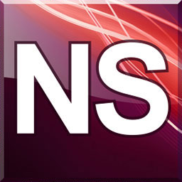

# genlinx-go

<div align="center">
    
</div>

---

[](https://goreportcard.com/report/github.com/Norgate-AV/genlinx-go)
[](https://godoc.org/github.com/Norgate-AV/genlinx-go)

---

A CLI utility for NetLinx projects 🚀🚀🚀 - Go Edition

This is a complete rewrite of the original [genlinx](https://github.com/Norgate-AV/genlinx) project in Go, providing better performance, maintainability, and cross-platform support.

## Features

- 🚀 **Fast**: Written in Go for optimal performance
- 🛠️ **Maintainable**: Clean architecture with proper separation of concerns
- 🔧 **Configurable**: Flexible configuration using Viper
- 📦 **Cross-platform**: Works on Windows, Linux, and macOS
- 🧪 **Testable**: Designed with testing in mind from the ground up

## Installation

### From Source

```bash
git clone https://github.com/Norgate-AV/genlinx.git
cd genlinx/go
make build
```

### Using Go Install

```bash
go install github.com/Norgate-AV/genlinx-go@latest
```

## Usage

```bash
genlinx [command]
```

### Available Commands

- `build` - Build NetLinx source files or CFG files
- `cfg` - Generate NetLinx build CFG files
- `archive` - Generate NetLinx workspace zip archives
- `config` - View/edit configuration properties
- `find` - Find NetLinx devices on the network

### Examples

```bash
# Build source files
genlinx build -s main.axs utils.axi

# Build from CFG file
genlinx build -c build.cfg

# Generate CFG file
genlinx cfg -w workspace.apw

# Create archive
genlinx archive -w workspace.apw

# View configuration
genlinx config --list
```

## Configuration :gear:

The application uses a hierarchical configuration system with **automatic path normalization**:

1. **Default values** (built-in, OS-appropriate paths)
2. **Local config** (`./genlinx.json`)
3. **Global config** (`~/.config/genlinx/genlinx.json`)
4. **Environment variables** (`GENLINX_*`)
5. **Command-line flags** (normalized automatically)

### Path Normalization 🛠️

The application automatically normalizes paths to the correct format for your operating system:

- **Windows**: Converts forward slashes to backslashes (`C:/path` → `C:\path`)
- **Linux/macOS**: Converts backslashes to forward slashes (`C:\path` → `/path`)
- **Cross-platform**: Handles mixed separators correctly

This means you can use forward slashes in configuration files even on Windows, and they'll work correctly.

### Configuration File

```json
{
    "cfg": {
        "outputFile": "build.cfg",
        "outputLogFile": "build.log",
        "includePath": ["C:/Program Files (x86)/Common Files/AMXShare/AXIs"],
        "modulePath": [
            "C:/Program Files (x86)/Common Files/AMXShare/Duet/module"
        ],
        "libraryPath": ["C:/Program Files (x86)/Common Files/AMXShare/SYCs"]
    },
    "build": {
        "nlrc": {
            "path": "C:/Program Files (x86)/Common Files/AMXShare/COM/NLRC.exe",
            "includePath": [
                "C:/Program Files (x86)/Common Files/AMXShare/AXIs"
            ],
            "modulePath": [
                "C:/Program Files (x86)/Common Files/AMXShare/Duet/module"
            ],
            "libraryPath": ["C:/Program Files (x86)/Common Files/AMXShare/SYCs"]
        }
    }
}
```

### Testing Path Normalization

You can test path normalization with:

```bash
genlinx test-paths
```

This command demonstrates how various path formats are normalized for your operating system.

## Development

### Prerequisites

- Go 1.21 or later
- Make (optional, for using the Makefile)

### Building

```bash
# Build for current platform
make build

# Build for all platforms
make build-all

# Development build (includes formatting, vetting, and testing)
make dev
```

### Testing

```bash
# Run tests
make test

# Run tests with coverage
make test-coverage
```

### Code Quality

```bash
# Format code
make fmt

# Run go vet
make vet

# Tidy modules
make mod-tidy
```

## Architecture

The project follows a clean architecture pattern:

```
├── cmd/           # CLI commands
├── internal/      # Private application code
│   ├── config/    # Configuration management
│   ├── compiler/  # NetLinx compiler interface
│   └── utils/     # Utility functions
├── main.go        # Application entry point
└── go.mod         # Go module definition
```

### Key Components

- **CLI Layer** (`cmd/`): Command definitions using Cobra
- **Configuration** (`internal/config/`): Configuration management with Viper
- **Compiler** (`internal/compiler/`): NetLinx compiler abstraction
- **Utils** (`internal/utils/`): Common utility functions

## Contributing

1. Fork the repository
2. Create a feature branch (`git checkout -b feature/amazing-feature`)
3. Commit your changes (`git commit -m 'Add amazing feature'`)
4. Push to the branch (`git push origin feature/amazing-feature`)
5. Open a Pull Request

## License

This project is licensed under the MIT License - see the [LICENSE](../LICENSE) file for details.

## Related Projects

- [Original genlinx](https://github.com/Norgate-AV/genlinx) - Node.js/TypeScript version
- [AMX NetLinx](https://www.amx.com/en/products/netlinx) - NetLinx programming language

## Acknowledgments

- Original project by [Norgate AV](https://github.com/Norgate-AV)
- Built with [Cobra](https://github.com/spf13/cobra) and [Viper](https://github.com/spf13/viper)
